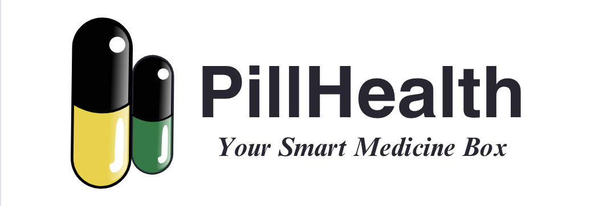

# `pillhealth`

_for legal reasons, the logo is a joke_

 

**PillHealth** is a smart medicine box. You **store** medicines, you **schedule** your doses, and you **take** them when it's time to.

PillHealth also provides logs of **what** you've taken and **when** you've taken it, so you know whether you're on track with your health management.

The core of PillHealth is the trusty **ESP8266 microcontroller**, which interfaces with a **Supabase** instance via **Arduino**. The Supabase instance's data is used by the frontend, which is made using **SvelteKit**.

PillHealth ended up as the **Champion** of **IoT Cup 2024**, hosted by UP Diliman's [Department of Computer Science](https://dcs.upd.edu.ph/) and [Enstack](https://www.enstack.com/?srsltid=AfmBOoorOGdszTT63GqqFQVd6jSPfM-uO9tdw0qW_fz5gSXL9RThQ-Yz). [[reference]](https://dcs.upd.edu.ph/news/iot-cup-2024/)
